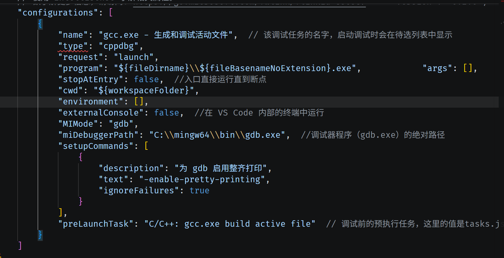
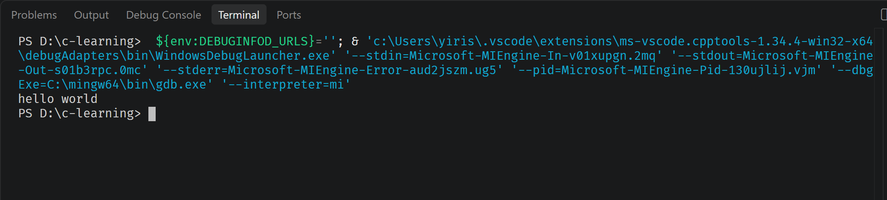
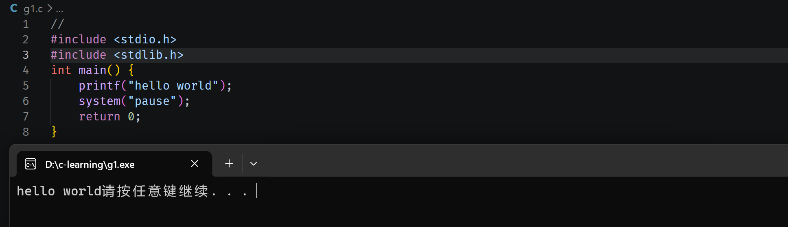
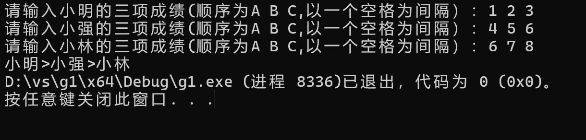

# 计算机系统-T1（感想在文末

# part1_了解C语言配置文件

### Q1

**GCC**：是一个编译器，它能把我们写的 C/C++ 源代码（.c 文件）翻译成电脑能看得懂的机器语言，生成可执行程序。

**MinGW**：因为 GCC 原生不能直接在 Windows 上用，MinGW 把 GCC 移植到 Windows，让我们在 Windows 电脑上也能用 GCC 编译 C 代码。

### Q2

1. **c_cpp_properties.json**：使编辑器识别C 语言头文件在哪、编译器路径是什么。
2. **tasks.json**：任务配置。用来调用编译器（GCC），执行**编译代码**这个操作，把`.c`源文件编译成 exe 程序。
3. **launch.json**：调试配置。用来启动**调试**功能，设置断点、一步步看变量的值，方便找代码 bug。

### Q3

纯文本编辑器，原生不认识 C 语言。插件让 VSCode 变成能写 C 语言的开发环境。

这个小任务完成的挺坎坷。（其实探究很久求助后才发现是win的智能应用控制对vscode的运行有影响，

# part3_函数

1.因为传递的只是数值的副本，函数内部对副本的任何修改，都不会影响到外部的原始变量。

2.需要“传地址”，使用指针。

第一题的解答结束了。直到今天才提交上来。可能我在计算机上没有太多天分或者说没有特别的下狠劲，可能我之前了解的知识太少了，看了easy2以及icoding上的好些题才陆陆续续学会了怎么用指针，结构体。说实话从一个电脑小白到弄清地址，定义字符串，定义函数还是有不小的挑战，从暑假就开始蠢蠢欲动，在微光群里蹲着，后来听了宣讲，后来上课适应大学生活，学习c语言，学着安装vs，后来学着看懂题，学着用github。本来打算国庆大干一场看看学习了一个月边角料能完成多少招新题，不幸接二连三地发烧。也是庆祝烧终于退了，用假期跟病魔殊死搏斗。回想起来，这个easy1我真的做了好久（过程就略了，一边怀疑一边好奇一边饥渴一边跌倒。。。哪怕我会的很少，我愿意继续学，嗯。如果有幸，希望微光带我继续学

